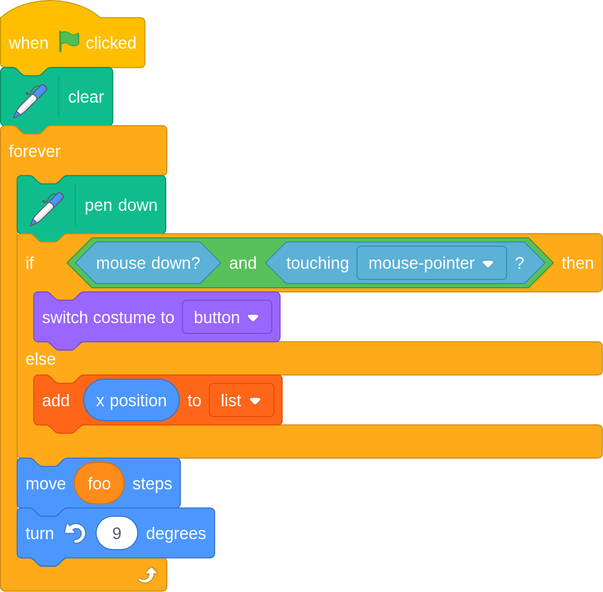

Scratch
#######################################

**Processor name:** ``scratch``

.. danger::

  Scratch blocks require an understanding of the Scratch programming language and how Verto is integrated with other systems. The use of this processor requires co-ordination between authors and developers to achieve the desired functionality.

.. note::

    The following examples assume usage of the fenced code extension, by having
    ``markdown.extensions.fenced_code`` in the list of extensions given to Verto.

You can include an image of Scratch blocks using
`Scratch Block Plugin notation`_ using the following notation:

.. literalinclude:: ../../../verto/tests/assets/scratch/doc_example_basic_usage.md
    :language: none

to produce the following image:

The syntax is the same for default Markdown code blocks. The only difference
is that Verto handles the content differently due to the ``scratch`` language
set at the start.

.. note::

    This processor also works with syntax introduced by the `fenced_blocks`
    and/or `codehilite` extensions.

You can test the output of your Scratch block text (and create PNG
or SVG images) at `scratchblocks.github.io`_.

.. warning::

    Verto doesn't create the Scratch images itself, but prepares it for a
    JavaScript library to render these in the user's browser.
    See :ref:`rendering-scratch-images` section below.

The default HTML for scratch blocks is:

.. literalinclude:: ../../../verto/html-templates/scratch.html
    :language: css+jinja

Using the following example tag:

.. literalinclude:: ../../../verto/tests/assets/scratch/doc_example_basic_usage.md
    :language: none

The resulting HTML would be:

.. literalinclude:: ../../../verto/tests/assets/scratch/doc_example_basic_usage_expected.html
    :language: html

.. _rendering-scratch-images:

Rendering Scratch blocks as images
***************************************

When Verto encounters a code block with the Scratch language (see example
above), it doesn't not generate the image but renders the block code inside an
element for the `scratchblocks package`_ to render in the user's browser.
View the package website for more information on how to use it.

Overriding HTML for Scratch
***************************************

When overriding the HTML for Scratch code, the following Jinja2 placeholders are available:

- ``{{ scratch_blocks }}`` - The text of the Scratch blocks notation.

**Example**

For example, providing the following HTML:

.. literalinclude:: ../../../verto/tests/assets/scratch/doc_example_override_html_template.html
    :language: css+jinja

with the following tag:

.. literalinclude:: ../../../verto/tests/assets/scratch/doc_example_override_html.md
    :language: none

would result in:

.. literalinclude:: ../../../verto/tests/assets/scratch/doc_example_override_html_expected.html
    :language: html

.. _Scratch Block Plugin notation: https://wiki.scratch.mit.edu/wiki/Block_Plugin
.. _scratchblocks.github.io: https://scratchblocks.github.io/#?style=scratch3&script=when%20flag%20clicked%0Aclear%0Aforever%0Apen%20down%0Aif%20%3C%3Cmouse%20down%3F%3E%20and%20%3Ctouching%20%5Bmouse-pointer%20v%5D%3F%3E%3E%20then%0Aswitch%20costume%20to%20%5Bbutton%20v%5D%0Aelse%0Aadd%20(x%20position)%20to%20%5Blist%20v%5D%0Aend%0Amove%20(foo)%20steps%0Aturn%20ccw%20(9)%20degrees
.. _scratchblocks package: https://github.com/scratchblocks/scratchblocks#readme
